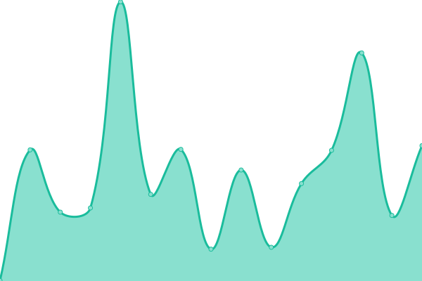
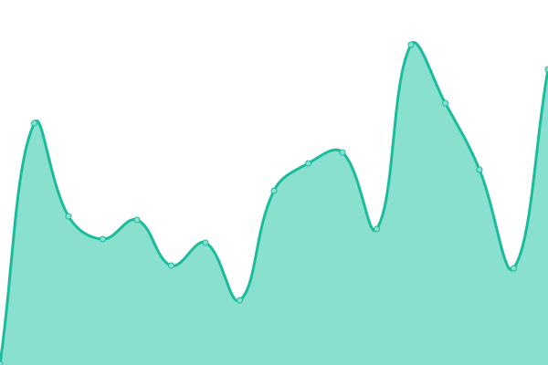

# [📈 Live Status](https://project516.dev): <!--live status--> **🟩 All systems operational**

This repository contains the open-source uptime monitor and status page for [Project516](https://project516.dev), powered by [Upptime](https://github.com/upptime/upptime).

With [Upptime](https://upptime.js.org), you can get your own unlimited and free uptime monitor and status page, powered entirely by a GitHub repository. We use [Issues](https://github.com/project516/upptime/issues) as incident reports, [Actions](https://github.com/project516/upptime/actions) as uptime monitors, and [Pages](https://project516.dev) for the status page.

<!--start: status pages-->
<!-- This summary is generated by Upptime (https://github.com/upptime/upptime) -->
<!-- Do not edit this manually, your changes will be overwritten -->
<!-- prettier-ignore -->
| URL | Status | History | Response Time | Uptime |
| --- | ------ | ------- | ------------- | ------ |
|  [Home Page](https://project516.dev) | 🟩 Up | [home-page.yml](https://github.com/Project516/upptime/commits/HEAD/history/home-page.yml) | 

 233ms
     
 | 

<a href="https://status.project516.dev/history/home-page">100.00%</a>
    

|  [Tor Browser](https://tor.project516.dev) | 🟩 Up | [tor-browser.yml](https://github.com/Project516/upptime/commits/HEAD/history/tor-browser.yml) | 

 588ms
     
 | 

<a href="https://status.project516.dev/history/tor-browser">100.00%</a>
    

|  [Titled Games Website](https://titledgames.project516.dev) | 🟩 Up | [titled-games-website.yml](https://github.com/Project516/upptime/commits/HEAD/history/titled-games-website.yml) | 

 219ms
     
 | 

<a href="https://status.project516.dev/history/titled-games-website">100.00%</a>
    

<!--end: status pages-->

[**Visit our status website →**](https://project516.dev)

## 📄 License

- Powered by: [Upptime](https://github.com/upptime/upptime)
- Code: [MIT](./LICENSE) © [Anand Chowdhary](https://anandchowdhary.com), supported by [Pabio](https://pabio.com)
- Data in the `./history` directory: [Open Database License](https://opendatacommons.org/licenses/odbl/1-0/)
